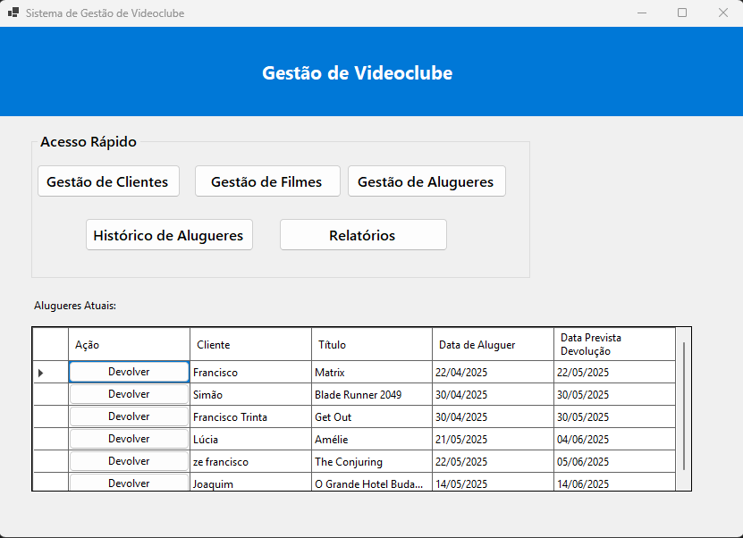
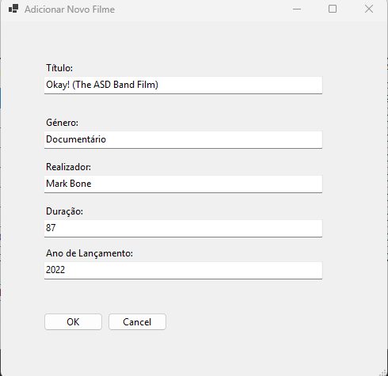
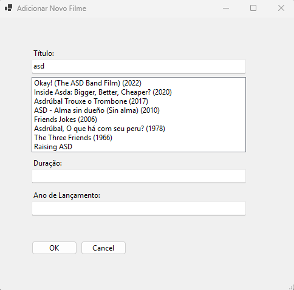
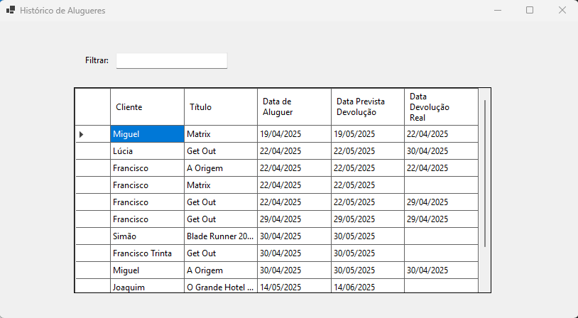
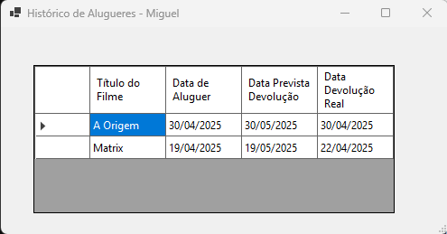
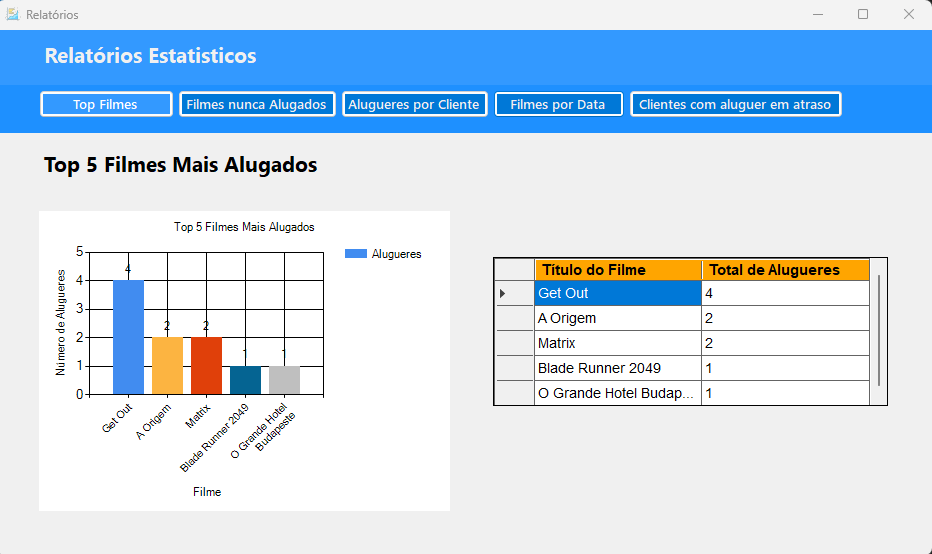
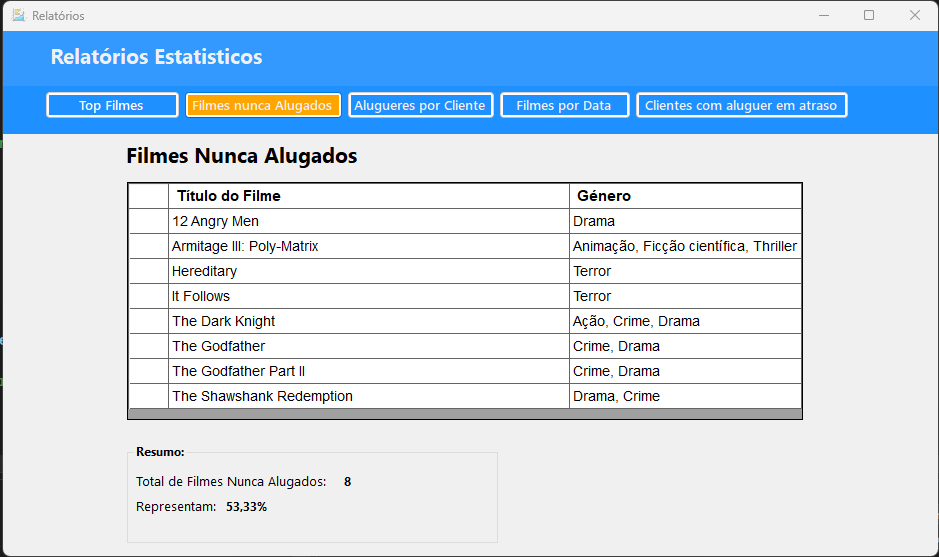
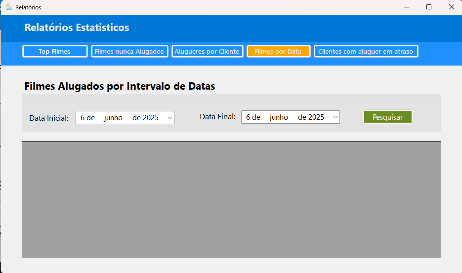

VideoClubManagementSystem-CSharp-SQL
A desktop application for video rental store management, developed in C# (Windows Forms) with a SQL Server database and integrated with the TMDB API. This project focuses on efficient video store operations and data analysis, demonstrating full-stack development skills and attention to software robustness.

Architecture and Key Features
This system offers a comprehensive solution for video store management, highlighted by:

SQL Server Database: The database was modeled to ensure referential integrity and data consistency. It leverages Stored Procedures and Views for query optimization, encapsulation of business logic, and enhanced security.
C# (Windows Forms): A functional and intuitive desktop application interface, designed for a fluid user experience.
Robust Error Handling: Developed with try-catch blocks across all critical operations, ensuring proper exception capture and handling, preventing unexpected failures, and improving system stability.
External API Integration (TMDB): Features automatic movie data population via an external API, streamlining the cataloging process and ensuring accurate information.
Comprehensive Management: Complete modules for client, movie, and rental management, including return logging and detailed individual client history.
Statistical Reports and Data Analysis: Generates important statistical reports (e.g., "Top Rented Movies", "Never Rented Movies", "Rentals by Date Range", and "Overdue Rentals by Client"), providing valuable insights for strategic decision-making. The "Clients with Overdue Rentals" report, in particular, demonstrates real-time monitoring capability and automated contact functionality, emphasizing the system's proactive approach to managing outstanding balances.
Database Structure
The system utilizes a SQL Server database. The Entity-Relationship Diagram (ERD) below illustrates the table structure and their relationships, ensuring data integrity and optimizing operations.

Visual representation of the Video Club database structure.

Main Tables:

Clientes: Stores information about video store clients.
Filmes: Contains details about available movies.
Alugueres: Records rental transactions, including rental date, return date, and status.
SQL Scripts:
The complete script for creating the database, tables, views, and stored procedures is available in the Database/ folder of the repository.

How to Set Up and Run the Project
To set up and run this application locally, follow the steps below:

Prerequisites
Ensure you have the following software installed in your development environment:

Microsoft SQL Server: To host the project database. You can use SQL Server Express (a free version).
SQL Server Management Studio (SSMS) or a similar tool: Essential for managing the database and executing the provided SQL scripts.
Visual Studio 2022 (or compatible version): To open, compile, and run the C# (Windows Forms) application.

 - Setup Steps -
Clone the Repository:
Open Git Bash or your command-line terminal. Navigate to the folder where you want to save the project and execute the following command:
git clone https://github.com/Mankz111/VideoClubManagementSystem-CSharp-SQL.git

Configure the SQL Server Database:

Create a New Database: In SQL Server Management Studio (SSMS), connect to your SQL Server instance. Right-click on "Databases" in the Object Explorer and select "New Database...". We suggest the name VideoClubDB for this database.
Execute the Creation Script:
Navigate to the Database/ folder within the cloned project on your computer.
Open the database_schema.sql file in SSMS.
Ensure you are connected to the database you created (VideoClubDB) in SSMS (by selecting it from the "Available Databases" dropdown or by using USE VideoClubDB; at the beginning of the script).
Execute the script to create all necessary tables, views, and stored procedures for the system.
(Optional) Populate with Sample Data:
If a sample_data.sql file exists in the Database/ folder, you can also execute it in SSMS (targeting VideoClubDB) to populate the database with some test data, making it easier to start using the application immediately.
Configure the Application's Connection String:

Open the C# solution (.sln file) of the project in Visual Studio.

In the "Solution Explorer", locate and open the App.config file (this file is usually at the root of your C# project, for example, VideoClubManagementSystem/App.config).

Inside App.config, find the <connectionStrings> section. You will need to update the connectionString to point to your local SQL Server instance and the database name you created.

Example of how to adjust: Data Source=YOUR_SQL_SERVER_NAME;Initial Catalog=VideoClubDB;Integrated Security=True;Encrypt=False;TrustServerCertificate=True
YOUR_SQL_SERVER_NAME: Replace with a value like localhost, .\SQLEXPRESS, or your computer's name followed by \SQLEXPRESS (if you are using the SQL Server Express edition).
VideoClubDB: This should be the exact name of the database you created in SSMS.
Integrated Security=True: Indicates that the application will use Windows authentication. If you prefer to use an SQL user and password, change it to User ID=YourSQLUser;Password=YourSQLPassword;.
Encrypt=False;TrustServerCertificate=True: These additional parameters might be necessary depending on your SQL Server version and security configuration to avoid connection errors.
Compile and Run the Application:

In Visual Studio, go to the "Build" menu and select "Build Solution".
After a successful build, click the "Start" button in the Visual Studio toolbar (or press F5) to run the application.

## Application Screenshots

See some images of the system's interface in action:

### Application Overview

*The main interface of the video club management system.*

### Client Management

### Movie Management (with TMDB Integration)

### Rental Management

### Rental History

### Reports

