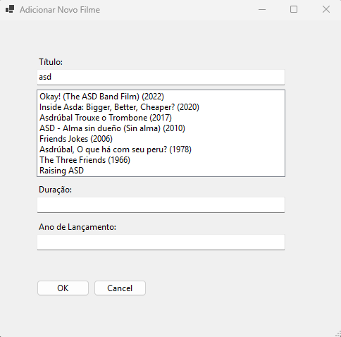
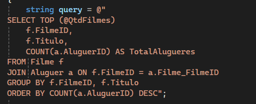
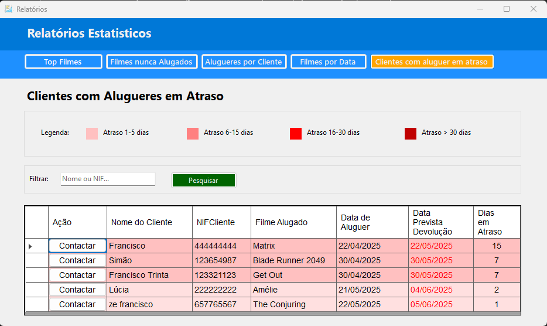

# 🎬 Video Club Management System (C# / SQL Server)

Uma robusta aplicação de desktop Windows para gestão de videoclubes, desenvolvida em C# (Windows Forms) e SQL Server, com integração nativa da API do TMDB para um enriquecimento automático dos dados dos filmes. Este projeto demonstra competências de desenvolvimento full-stack, manipulação eficiente de dados e um forte foco na robustez do software e na experiência do utilizador.

---

### 🚀 Funcionalidades Principais

* **Base de Dados SQL Server**
    * Modelada cuidadosamente para garantir a integridade dos dados e a consistência referencial.
    * Utiliza Stored Procedures e Views para otimizar consultas, encapsular a lógica de negócio e aumentar a segurança.

* **C# (Windows Forms)**
    * Interface de desktop moderna, intuitiva e responsiva.
    * Projetada para uma navegação fluida e facilidade de uso.

* **Gestão Robusta de Erros**
    * Utilização de blocos `try-catch` em todas as operações críticas para prevenir falhas inesperadas e aumentar a estabilidade do sistema.

* **Integração com a API do TMDB**
    * Preenchimento e sugestão automática de dados de filmes, mantendo o seu catálogo sempre atualizado com o mínimo de esforço manual.

* **Módulos de Gestão Abrangentes**
    * Gestão completa de clientes, filmes, alugueres, devoluções e históricos detalhados por cliente.
    * Operações CRUD (Criar, Ler, Atualizar, Apagar) para todas as entidades principais.

* **Relatórios e Análises Poderosos**
    * Gere relatórios acionáveis, tais como:
        * Filmes Mais Alugados
        * Filmes Nunca Alugados
        * Alugueres por Período
        * Alugueres Atrasados por Cliente
        * Clientes com Alugueres Atrasados (inclui monitorização em tempo real e funcionalidades de contacto).

---

### 🗄️ Estrutura da Base de Dados

O sistema utiliza uma base de dados SQL Server projetada para performance e fiabilidade.

* **Tabelas Principais:**
    * `Clientes`: Armazena os dados dos clientes do videoclube.
    * `Filmes`: O catálogo de filmes disponíveis.
    * `Alugueres`: Regista as transações de aluguer (data de aluguer, data de devolução, estado, etc.).

* **Scripts:**
    * Todos os scripts para a criação da base de dados (tabelas, views, stored procedures) estão localizados na pasta `Database/`.

---

### 🛠️ Começar a Usar

**Pré-requisitos:**
* Microsoft SQL Server (a edição Express é suficiente)
* SQL Server Management Studio (SSMS) ou uma ferramenta compatível
* Visual Studio 2022 (ou superior)

**1. Clonar o Repositório**
```sh
git clone [https://github.com/Mankz111/VideoClubManagementSystem-CSharp-SQL.git](https://github.com/Mankz111/VideoClubManagementSystem-CSharp-SQL.git)
```

**2. Configurar a Base de Dados**
1.  Abra o SSMS e crie uma nova base de dados (nome sugerido: `VideoClubDB`).
2.  Execute o script `Database/database_schema.sql` na base de dados que acabou de criar.
3.  (Opcional) Execute o script `Database/sample_data.sql` para popular a base de dados com dados de demonstração.

**3. Configurar a Aplicação**
1.  Abra a solução (`.sln`) no Visual Studio.
2.  No *Solution Explorer*, abra o ficheiro `App.config`.
3.  Edite a secção `<connectionStrings>` com os dados do seu servidor:
    ```xml
    <connectionStrings>
      <add name="VideoClubDB"
           connectionString="Data Source=O_NOME_DO_SEU_SERVIDOR_SQL;Initial Catalog=VideoClubDB;Integrated Security=True;Encrypt=False;TrustServerCertificate=True"/>
    </connectionStrings>
    ```
    * Substitua `O_NOME_DO_SEU_SERVIDOR_SQL` pelo nome da sua instância SQL Server (ex: `localhost`, `.\SQLEXPRESS`, ou o nome da sua máquina).
    * Ajuste a string de conexão se necessitar de autenticação SQL.

**4. Compilar e Executar**
1.  No Visual Studio, compile a solução (Build > Build Solution).
2.  Inicie a aplicação (botão Start ou tecla F5).

---

### 🖼️ Imagens da Aplicação

*Visão Geral (Dashboard)*


*Gestão de Clientes*


*Gestão de Filmes e Integração TMDB*



*Gestão de Alugueres e Histórico*


*Relatórios*



---

### 📂 Estrutura de Pastas

```
├── Database/
│   ├── database_schema.sql
│   └── sample_data.sql
├── Prints1/                  # Screenshots da aplicação
├── VideoClubManagementSystem/  # Código-fonte (C#)
│   ├── App.config
│   └── ... (outros ficheiros)
└── README.md
```

---

### 🤝 Contribuir

Contribuições, *issues* e pedidos de novas funcionalidades são bem-vindos!
Sinta-se à vontade para fazer um *fork* do repositório e submeter *pull requests*.

---

### 📄 Licença

Este projeto está licenciado sob a Licença MIT.

---

### 📬 Contacto

Para questões ou suporte, por favor, abra uma *issue* no GitHub ou contacte **Mankz111**.

